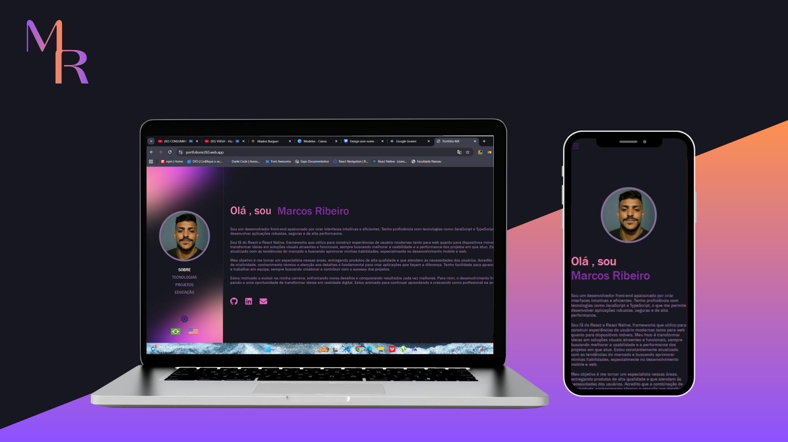

# Meu Portfólio de Desenvolvedor

Olá! Sou Marcos Ribeiro e este é o meu portfólio digital, criado para exibir meus projetos, habilidades e experiência como desenvolvedor Front-end e Mobile.



## 🚀 Tecnologias e Ferramentas

Este projeto foi desenvolvido com uma base sólida de tecnologias modernas para garantir uma experiência de usuário fluida e um código escalável.

* **React**: A espinha dorsal da aplicação, utilizada para construir a interface de usuário.

* **React Router DOM**: Para gerenciar a navegação entre as páginas do portfólio.

* **Styled-Components**: Para estilização e design responsivo.

* **TypeScript**: Melhoria da Produtividade e da Manutenção

## ✨ Funcionalidades Principais

* **Página Inicial (Home)**: Uma introdução sobre quem eu sou e uma visão geral do meu trabalho.

* **Página "Sobre"**: Detalhes sobre minha trajetória, habilidades técnicas e soft skills.

* **Página de Projetos**: Uma galeria dinâmica com os projetos que desenvolvi, incluindo links para o código e para a demo online.

* **Página de Certificados**: uma galeria dinâmica com minhas formações e meus sertificados.

## 📦 Como Rodar o Projeto Localmente

Se você deseja explorar o código ou rodar o projeto na sua máquina, siga os passos abaixo:

1. **Clone o repositório:**
   ```
   git clone https://github.com/Marcsfic98/My_Portifolio.git
   ```
2. **Acesse o diretório do projeto:**
   ```
   cd My_portifolio
   ```

   O portfólio estará disponível em https://portfoliomr265.web.app/.

## 🤝 Conecte-se Comigo

Sinta-se à vontade para se conectar comigo e saber mais sobre meu trabalho:

* **LinkedIn**: https://www.linkedin.com/in/marcsfic/
* **GitHub**: https://github.com/Marcsfic98/
* **Email**: Marcsfic98@gmail.com

---

Feito  por **Marcos Ribeiro**
